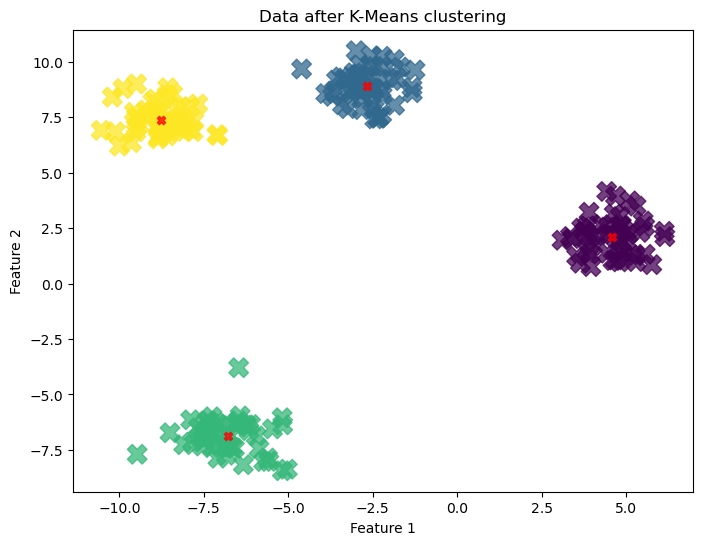

# Unsupervised Learning: K-Means Clustering 🧠

This project serves as an introduction to **unsupervised machine learning**, specifically focusing on the K-Means clustering algorithm. Unlike supervised learning, where we have labeled data to predict a target, the goal here is to find hidden patterns and structures in unlabeled data.

---

## What is K-Means Clustering?

**K-Means** is an algorithm that automatically groups a dataset into a specified number of clusters (denoted by "K"). It works by:

1. Initializing "K" cluster centers at random locations.
2. Assigning each data point to its nearest cluster center.
3. Updating the cluster centers to be the mean of all points assigned to them.
4. Repeating steps 2 and 3 until the cluster assignments no longer change.

The result is a set of distinct, non-overlapping clusters.

---

## Project Workflow

To demonstrate the effectiveness of K-Means, we don't use real-world data. Instead, we generate synthetic data that has clear, predefined clusters and then challenge the algorithm to find them.

### 1. Generating Synthetic Data
We use the `make_blobs` function from scikit-learn to create a simple 2D dataset with 4 distinct clusters. The first visualization shows this raw, unclustered data, where all points are the same color.

### 2. Applying the K-Means Algorithm
We instantiate the `KMeans` model from scikit-learn, telling it that we expect to find K=4 clusters. We then fit this model to our data. Notice that we only pass `X` (the features) to the model, as there is no `y` (target variable) in unsupervised learning.

### 3. Visualizing the Results
After the model is trained, we generate a second plot. This plot colors each data point according to the cluster label assigned to it by the K-Means algorithm. We also plot the final cluster centers (the "centroids") as red 'X's. The visualization clearly shows that the algorithm successfully identified the four original groups.

### 4. The Code
Here is the complete Python script used for this demonstration:

```python
import matplotlib.pyplot as plt
from sklearn.datasets import make_blobs
from sklearn.cluster import KMeans

# Generate Synthetic data
X, y_true = make_blobs(n_samples=200, centers=4, cluster_std=0.8, random_state=42)

# Plot th data we just created to see what it looks like.
plt.figure(figsize=(8, 6))
plt.scatter(X[:, 0], X[:, 1], s=50)
plt.title("Our raw, unclustered data")
plt.xlabel("Feature 1")
plt.ylabel("Feature 2")
plt.show()

# Apply the K-Means Algo
# Instantiate the KMeans Model
kmeans = KMeans(n_clusters=4, random_state=42, n_init=10)

# Fit the model to the data X.
kmeans.fit(X)

# Get the cluster assignments for each data point
y_kmeans = kmeans.predict(X)

# Plot data again
plt.figure(figsize=(8, 6))
plt.scatter(X[:, 0], X[:, 1], c=y_kmeans, s=200, alpha=0.75, marker='X')

# Plot centers of the clusters
centers = kmeans.cluster_centers_
plt.scatter(centers[:, 0], centers[:, 1], c='red', alpha=0.75, marker='X')

plt.title("Data after K-Means clustering")
plt.xlabel("Feature 1")
plt.ylabel("Feature 2")
plt.show()
```
## Results
